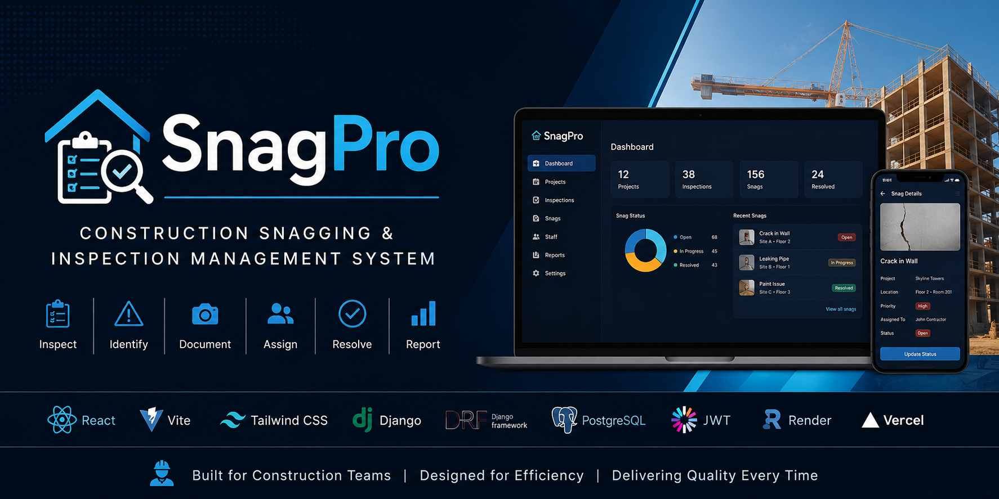
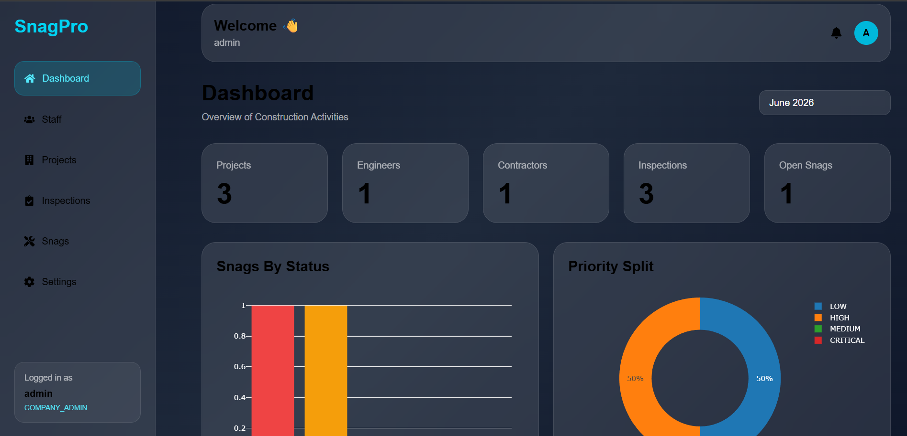
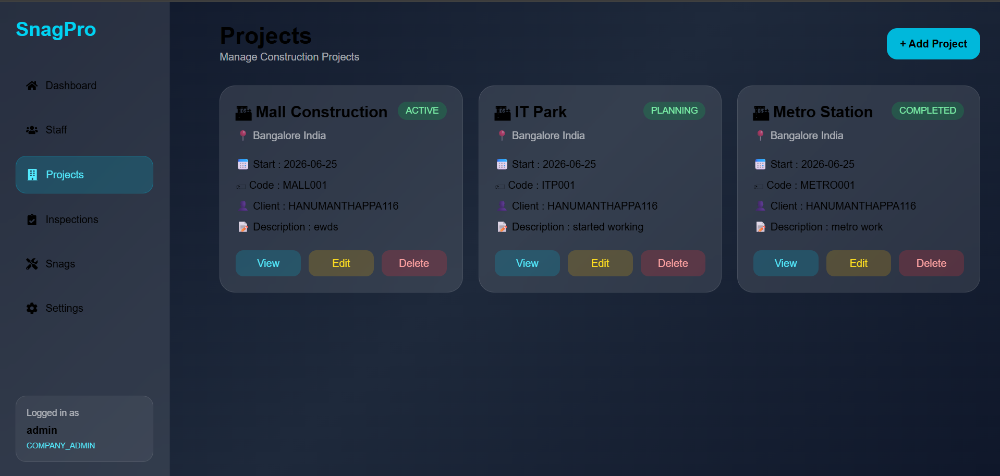
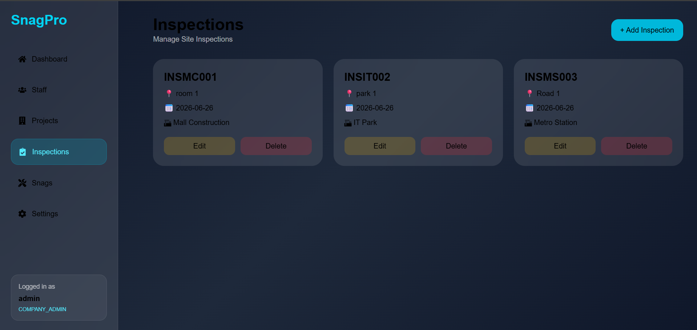
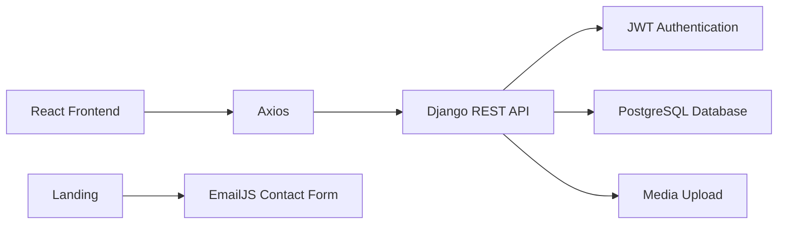
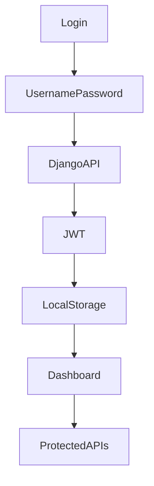
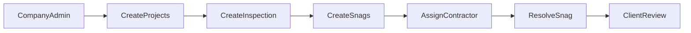
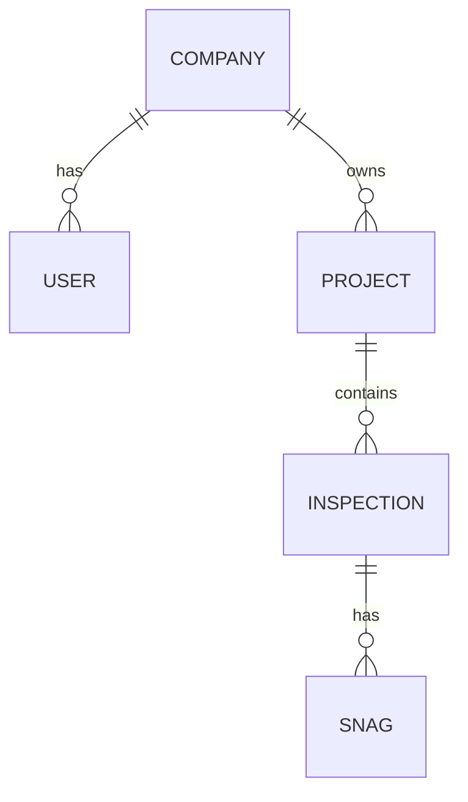

  

<h1 align="center">🚧 SnagPro Frontend</h1>

Construction Snagging & Inspection Management System

React • Django REST Framework • PostgreSQL • JWT • Tailwind CSS • Render • Vercel

---

## 🌐 Live Demo

### Frontend
https://your-vercel-url.vercel.app

### Backend API
https://snagpro-backend.onrender.com

---

# 📖 About

**SnagPro** is a modern Construction Snagging & Inspection Management System designed to simplify quality inspections, defect tracking, contractor assignments, and project management.

The application enables construction companies to efficiently manage inspections, monitor snag resolution, assign contractors, and provide clients with real-time project updates through a secure and responsive web platform.

---

# 🎯 Project Objectives

- Digitize construction snag management
- Reduce paperwork and manual inspections
- Track defects efficiently
- Assign contractors instantly
- Monitor project progress
- Improve communication between stakeholders
- Generate real-time inspection data

---

# ✨ Features

- 🔐 JWT Authentication
- 👨‍💼 Company Admin Dashboard
- 👷 Staff Management
- 🏗 Project Management
- 📋 Inspection Management
- 🚧 Snag Management
- 📷 Image Upload
- 👷 Contractor Assignment
- 👤 Profile Settings
- 🔑 Change Password
- 📊 Dashboard Analytics
- 🌐 Landing Page
- 📧 Contact Form using EmailJS
- 📱 Fully Responsive UI
- ✨ Glassmorphism Design

---

# 📸 Screenshots

## Landing Banner

---

## Dashboard

---

## Project Management

---

## Inspection Management

---

# 🏗 System Architecture

---

# 🔐 Authentication Flow

---

# 📋 Application Workflow

---

# 🗄 Database Structure

🚀 Tech Stack
Frontend
React.js
Vite
React Router DOM
Axios
Tailwind CSS
React Icons
EmailJS
Backend
Django
Django REST Framework
JWT Authentication
Gunicorn
Database
PostgreSQL (Neon)
Deployment
Render
Vercel
📂 Project Structure
src/

├── api/
├── assets/
├── components/
├── layouts/
├── pages/
├── routes/
├── App.jsx
└── main.jsx
🚀 Installation

Clone repository

git clone https://github.com/Hanumanth88600/snagpro-frontend.git

Go to project

cd snagpro-frontend

Install dependencies

npm install

Run development server

npm run dev

Open

http://localhost:5173
🔐 Authentication

The application uses JWT Authentication.

After successful login, the following are securely stored:

Access Token
Refresh Token
User Details
📧 Demo Request

The landing page includes a Demo Request Form powered by EmailJS.

Interested users can request:

Demo Login Credentials
Product Demonstration
Project Information

All requests are delivered directly to the developer via email.

🌍 Deployment

Frontend

Vercel

Backend

Render

Database

Neon PostgreSQL
🔗 Backend Repository

https://github.com/Hanumanth88600/snagpro-backend

👨‍💻 Developed By

Hanumanth H

MCA Graduate

Python Full Stack Developer

📫 Connect With Me
LinkedIn

https://www.linkedin.com/in/hanumanthappah-3759b4367/

GitHub

https://github.com/Hanumanth88600

Email

hanumanthappah5258@gmail.com

⭐ Support

If you found this project useful, please consider giving it a ⭐ on GitHub.

📄 License

This project is developed for educational, learning, and portfolio purposes.